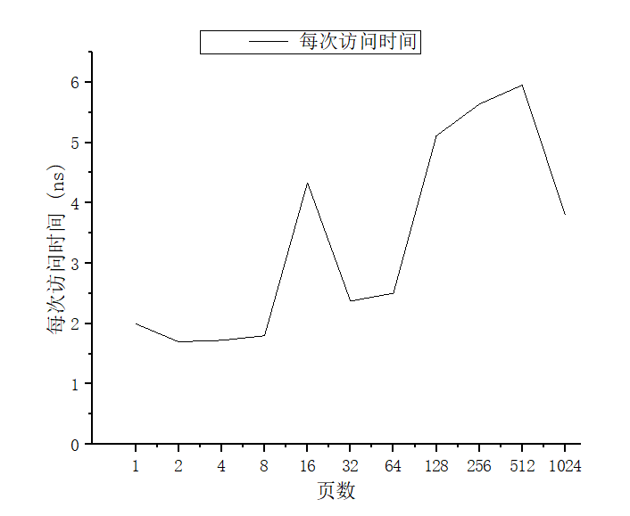

# 第三次作业

## 1.函数编写

```c
#include <stdio.h>
#include <sys/time.h>
#include <stdlib.h>
#include <string.h>

#define PAGESIZE 4096
  
int main(int argc, char *argv[])
{
	if(argc != 3) {
		fprintf(stderr, "error parameters!");
			exit(0);
	}
	struct timeval start, end;
	int NUMPAGES = atoi(argv[1]);
	int i,j, trynum = atoi(argv[2]);
	int jump = PAGESIZE / sizeof(int);
	int arr[NUMPAGES * jump];

	gettimeofday(&start, NULL);
	for(j = 0; j < trynum; ++j) {
		for(i = 0; i < NUMPAGES * jump; i += jump) {
			arr[i] += 1;
		}
	}
	gettimeofday(&end, NULL);
	printf("%f %ld %ld\n", ((double) end.tv_usec - start.tv_usec) / NUMPAGES / trynum, end.tv_usec, start.tv_usec);
	return 0;
}
```

程序的输入参数为：页的数目和尝试的次数。

输出的三个数分别为：

1. 数组访问的平均时间，以微秒为单位。这是通过计算测试过程中数组访问所需的总时间（以微秒为单位），并将其除以测试中数组访问的总次数得到的。该值表示访问一个数组元素所需的平均时间。
2. 测试结束时的时间戳（以微秒为单位）。
3. 测试开始时的时间戳（以微秒为单位）。

## 2.在64位 Ubuntu 上运行

编写一个 python 脚本，运行该程序，当访问页面从 1 增长到几千，每次迭代都乘 2。

python脚本为：

```python
#!/usr/bin/env python3
import os

i = 1
while i < 2000:
    print(f"\npage num {i}")
    val = os.system(f"./tlb {i} 10000")
    i *= 2
```

通过以下命令运行该脚本：

```bash
chmod +x test.py
python3 test.py
```

## 3.结果

```txt
page num 1
0.002000 475323 475303

page num 2
0.001700 476963 476929

page num 4
0.001725 478728 478659

page num 8
0.001800 480405 480261

page num 16
0.004338 482637 481943

page num 32
0.002375 487532 486772

page num 64
0.002505 490863 489260

page num 128
0.005113 500437 493892

page num 256
0.005639 517931 503494

page num 512
0.005956 556374 525880

page num 1024
0.003794 604223 565371
```

## 4.结果分析



第一级 TLB 的大小大约为 8～16。访问第一级 TLB 的开销大约为 2ns。

