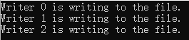
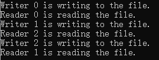

# 第五次作业

## 写者优先: 1. 写者线程的优先级高于读者线程。 2. 当写者到来时，只有那些已经获得授权的读进程才被允许完成 它们的操作，写者之后到来的读者将被推迟，直到写者完成。 3. 当没有写者进程时读者进程应该能够同时读取文件。

要实现写者优先的读者写者问题，可以使用互斥锁和条件变量来实现同步。下面是一个示例代码：

```cpp
#include <iostream>
#include <thread>
#include <mutex>
#include <condition_variable>
#include <chrono>

std::mutex read_mutex;  // 读者互斥锁
std::mutex write_mutex;  // 写者互斥锁
std::condition_variable read_cv;  // 读者条件变量
std::condition_variable write_cv;  // 写者条件变量
int num_readers = 0;  // 当前读者数量
bool is_writer_active = false;  // 写者是否处于活跃状态

void reader(int id) {
    std::unique_lock<std::mutex> read_lock(read_mutex);
    // 当有写者活跃时，读者等待
    read_cv.wait(read_lock, [] { return !is_writer_active; });

    num_readers++;
    read_lock.unlock();

    // 读取文件操作
    std::cout << "Reader " << id << " is reading the file." << std::endl;

    read_lock.lock();
    num_readers--;

    // 如果当前没有读者，则唤醒写者
    if (num_readers == 0) {
        write_cv.notify_one();
    }
    read_lock.unlock();
}

void writer(int id) {
    std::unique_lock<std::mutex> write_lock(write_mutex);

    // 当有读者或写者活跃时，写者等待
    write_cv.wait(write_lock, [] { return num_readers == 0 && !is_writer_active; });

    is_writer_active = true;
    write_lock.unlock();

    // 写入文件操作
    std::cout << "Writer " << id << " is writing to the file." << std::endl;

    write_lock.lock();
    is_writer_active = false;

    // 唤醒下一个等待的读者或写者
    if (read_cv.wait_for(write_lock, std::chrono::seconds(0)) == std::cv_status::no_timeout) {
        read_cv.notify_one();
    } else {
        write_cv.notify_one();
    }
    write_lock.unlock();
}

int main() {
    std::thread writers[3];
    std::thread readers[5];

    // 创建写者线程
    for (int i = 0; i < 3; ++i) {
        writers[i] = std::thread(writer, i);
    }

    // 创建读者线程
    for (int i = 0; i < 5; ++i) {
        readers[i] = std::thread(reader, i);
    }

    // 等待写者线程结束
    for (int i = 0; i < 3; ++i) {
        writers[i].join();
    }

    // 等待读者线程结束
    for (int i = 0; i < 5; ++i) {
        readers[i].join();
    }

    return 0;
}
```

上述代码运行截图如下



在上述代码中，读者线程和写者线程通过互斥锁（`read_mutex`和`write_mutex`）和条件变量（`read_cv`和`write_cv`）来实现同步。读者在执行读取文件操作前，会先检查是否有活跃的写者，如果有则等待条件变量`read_cv`的通知。写者在执行写入文件操作前，会先检查是否有活跃的读者或写者，如果有则等待条件变量`write_cv`的通知。这样就实现了写者优先的效果。

当没有写者进程时，读者进程可以同时读取文件。读者在执行读取操作前，会先检查是否有活跃的写者，如果没有则直接进行读取操作，而不需要等待。这是通过在读者线程中使用条件变量的等待函数`read_cv.wait(read_lock, [] { return !is_writer_active; });`来实现的。只有当没有活跃的写者时，读者线程才会被唤醒执行读取操作。

## 公平竞争：1. 优先级相同。 2. 写者、读者互斥访问。 3. 只能有一个写者访问临界区。 4. 可以有多个读者同时访问临界资源。

要实现公平竞争的读者写者问题，可以使用互斥锁和条件变量来实现同步。以下是一个示例代码：

```cpp
#include <iostream>
#include <thread>
#include <mutex>
#include <condition_variable>

std::mutex read_mutex;  // 读者互斥锁
std::mutex write_mutex;  // 写者互斥锁
std::condition_variable read_cv;  // 读者条件变量
std::condition_variable write_cv;  // 写者条件变量
int num_readers = 0;  // 当前读者数量
bool is_writer_active = false;  // 写者是否处于活跃状态

void reader(int id) {
    std::unique_lock<std::mutex> read_lock(read_mutex);

    // 读者等待，直到没有写者在临界区
    read_cv.wait(read_lock, [] { return !is_writer_active; });

    num_readers++;
    read_lock.unlock();

    // 读取文件操作
    std::cout << "Reader " << id << " is reading the file." << std::endl;

    read_lock.lock();
    num_readers--;

    // 如果当前没有读者，则唤醒一个写者
    if (num_readers == 0) {
        write_cv.notify_one();
    }
    read_lock.unlock();
}

void writer(int id) {
    std::unique_lock<std::mutex> write_lock(write_mutex);

    // 写者等待，直到没有读者和写者在临界区
    write_cv.wait(write_lock, [] { return num_readers == 0 && !is_writer_active; });

    is_writer_active = true;
    write_lock.unlock();

    // 写入文件操作
    std::cout << "Writer " << id << " is writing to the file." << std::endl;

    write_lock.lock();
    is_writer_active = false;

    // 唤醒下一个等待的读者或写者
    if (!read_cv.wait_for(write_lock, std::chrono::seconds(0), [] { return num_readers == 0; })) {
        write_cv.notify_one();
    } else {
        read_cv.notify_one();
    }
    write_lock.unlock();
}

int main() {
    std::thread writers[3];
    std::thread readers[5];

    // 创建写者线程
    for (int i = 0; i < 3; ++i) {
        writers[i] = std::thread(writer, i);
    }

    // 创建读者线程
    for (int i = 0; i < 5; ++i) {
        readers[i] = std::thread(reader, i);
    }

    // 等待写者线程结束
    for (int i = 0; i < 3; ++i) {
        writers[i].join();
    }

    // 等待读者线程结束
    for (int i = 0; i < 5; ++i) {
        readers[i].join();
    }

    return 0;
}
```

上述代码运行截图如下



在上述代码中，读者和写者线程使用互斥锁（`read_mutex`和`write_mutex`）和条件变量（`read_cv`和`write_cv`）来实现同步。读者在执行读取文件操作前，会先检查是否有活跃的写者，如果有则等待条件变量`read_cv`的通知。写者在执行写入文件操作前，会先检查是否有活跃的读者或写者，如果有则等待条件变量`write_cv`的通知。

公平竞争的要点是，在互斥锁和条件变量中使用适当的等待和唤醒机制，以确保读者和写者能够按照公平的顺序访问临界区。