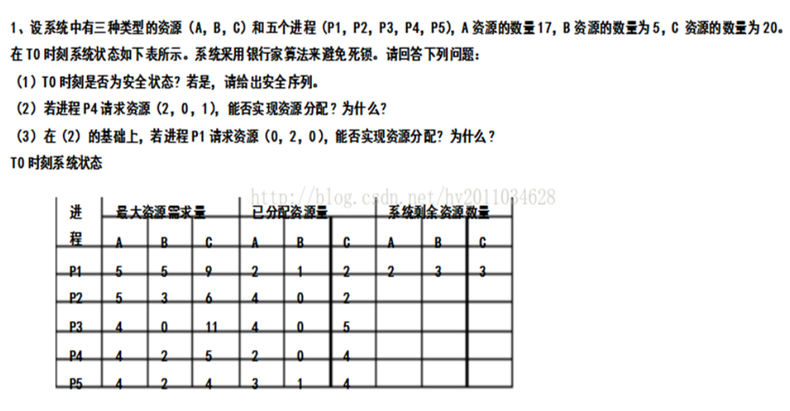

# 第六次作业



(1) 系统剩余资源数量=总的资源的数量-系统为每个进程已分配资源量之和

各进程需要的资源量need如下（最大资源需求量-已分配资源量）

```txt
     A   b   C
p1   3   4   7
p2   1   3   4
p3   0   0   6
p4   2   2   1
p5   1   1   0
```

先运行p4，再运行p5，此时系统的剩余资源变为7   4   11   

可以运行p1，p2，p3，

所以t0是安全状态，能够实现资源分配。一个安全序列为p4 p5 p1 p2 p3

(2) 若进程 p4 请求资源(2 , 0 , 1)

更新各进程需要的资源量

```txt
     A   b   C
p1   3   4   7
p2   1   3   4
p3   0   0   6
p4   0   2   0
p5   1   1   0
```

系统的剩余资源变为0   3   2

已分配资源量表中 p4 变为4   0   5

先运行p4，此时系统的剩余资源变为4   3   7

再运行p2，p3，p5，此时系统的剩余资源变为15   4   8

可以运行p1

所以能够实现资源分配，一个安全序列为p4 p2 p3 p5 p1

(3) 若进程p1再请求资源(0 , 2 , 0)

更新各进程需要的资源量

```txt
     A   b   C
p1   3   2   7
p2   1   3   4
p3   0   0   6
p4   0   2   0
p5   1   1   0
```

系统的剩余资源变为0   1   2

已分配资源量表中 p4 变为4   0   5
							  p1 变为2   3   2

此时系统的剩余资源已不能满足任何一个进程所需，故不能实现资源分配