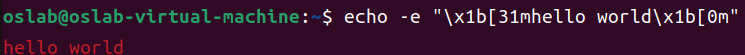
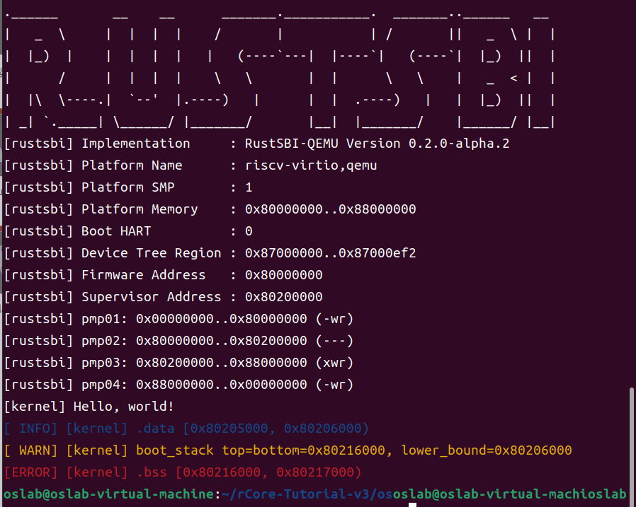

# lab1

## 编程题

### 1.实现一个linux应用程序A，显示当前目录下的文件名。（用C或Rust编程）

程序A的C语言代码如下：

```C
#include <dirent.h>
#include <stdio.h>

int main() {
    DIR *dir = opendir(".");//打开当前工作目录（即“.”表示当前目录），并返回一个指向该目录流的指针（即DIR *类型的变量dir）
    struct dirent *entry;//定义了一个指向目录项的指针
    while ((entry = readdir(dir))) //循环读取dir指向的目录中的每个目录项，并将其赋值给entry指针，当读取结束后readdir()函数会返回NULL，循环将结束
    {
        printf("%s\n", entry->d_name);
    }
    return 0;
}
```

输出结果为：

```txt
.vscode
..
1_3
1_1
1_3.c
.
1_2.c
1_2
1_1.c
```

这段代码使用了C语言中的标准库函数和系统调用，其作用是打开当前工作目录并列出其中的所有文件和子目录的名称。具体解释如下：

- `#include <dirent.h>`：包含了用于操作目录的相关函数和数据结构的头文件。
- `#include <stdio.h>`：包含了用于输入输出的相关函数的头文件。
- `DIR *dir = opendir(".");`：打开当前工作目录（即“.”表示当前目录），并返回一个指向该目录流的指针（即DIR *类型的变量dir）。
- `struct dirent *entry;`：定义了一个指向目录项的指针。
- `while ((entry = readdir(dir)))`：循环读取dir指向的目录中的每个目录项，并将其赋值给entry指针，当读取结束后readdir()函数会返回NULL，循环将结束。
- `printf("%s\n", entry->d_name);`：输出entry指向的目录项的名称。
- `return 0;`：程序正常退出。

### 2.实现一个linux应用程序B，能打印出调用栈链信息。（用C或Rust编程）

应用程序B的C语言代码如下：

```c
#include <inttypes.h>
#include <stdint.h>
#include <stdio.h>

#define UNW_LOCAL_ONLY
#include <libunwind.h>

// Compile with -funwind-tables -lunwind
void print_stack_trace_libunwind() 
{
    printf("=== Stack trace from libunwind ===\n");

    unw_cursor_t cursor; unw_context_t uc;
    unw_word_t pc, sp;

    unw_getcontext(&uc);
    unw_init_local(&cursor, &uc);

    while (unw_step(&cursor) > 0) 
    {
        unw_get_reg(&cursor, UNW_REG_IP, &pc);
        unw_get_reg(&cursor, UNW_REG_SP, &sp);

        printf("Program counter: 0x%016" PRIxPTR "\n", (uintptr_t) pc);
        printf("Stack pointer: 0x%016" PRIxPTR "\n", (uintptr_t) sp);
        printf("\n");
    }
    printf("=== End ===\n\n");
}

int main() 
{
    print_stack_trace_libunwind();
    return 0;
}
```

需要通过以下一系列指令安装`libunwind`库

```bash
sudo apt install libunwind8-dev
```

再在终端中使用`gcc 1_2.c -o 1_2 -lunwind`对改程序进行编译。使用`./1_2`运行该程序，结果如下：

```txt
=== Stack trace from libunwind ===
Program counter: 0x0000562303c0e34b
Stack pointer: 0x00007fff07e022d0

Program counter: 0x00007f58a5d4dd90
Stack pointer: 0x00007fff07e022e0

Program counter: 0x00007f58a5d4de40
Stack pointer: 0x00007fff07e02380

Program counter: 0x0000562303c0e165
Stack pointer: 0x00007fff07e023d0

=== End ===
```

对代码的分析如下：

```c
#include <inttypes.h>
#include <stdint.h>
#include <stdio.h>
```

这些是标准 C 库的头文件，其中包括格式化输出所需的 stdio.h 和整数类型所需的 inttypes.h 和 stdint.h。

```c
#define UNW_LOCAL_ONLY
#include <libunwind.h>
```

定义了一个名为 `UNW_LOCAL_ONLY` 的宏并包含了 `libunwind.h` 头文件，该库提供了访问程序运行时堆栈跟踪信息的功能。

```c
// Compile with -funwind-tables -lunwind
```

该注释提供了编译该程序时需要添加的选项，其中 `-funwind-tables` 和 `-lunwind` 用于启用对 `libunwind` 库的支持。

```c
void print_stack_trace_libunwind() 
{
    printf("=== Stack trace from libunwind ===\n");

    unw_cursor_t cursor; unw_context_t uc;
    unw_word_t pc, sp;

    unw_getcontext(&uc);
    unw_init_local(&cursor, &uc);

    while (unw_step(&cursor) > 0) 
    {
        unw_get_reg(&cursor, UNW_REG_IP, &pc);
        unw_get_reg(&cursor, UNW_REG_SP, &sp);

        printf("Program counter: 0x%016" PRIxPTR "\n", (uintptr_t) pc);
        printf("Stack pointer: 0x%016" PRIxPTR "\n", (uintptr_t) sp);
        printf("\n");
    }
    printf("=== End ===\n\n");
}
```

这个函数使用了 libunwind 库来打印函数调用堆栈。具体实现步骤如下：

1. 首先打印一条开始标记

2. 初始化一个 `unw_context_t` 结构体 `uc`，并获取当前线程的上下文信息，即调用 `unw_getcontext(&uc)`。

3. 初始化一个 `unw_cursor_t` 结构体 `cursor`，并将其指向当前线程的栈顶，即调用 `unw_init_local(&cursor, &uc)`。

4. 循环遍历调用堆栈，即调用 `unw_step(&cursor)`，直到遍历完整个调用堆栈。

   `unw_step()` 返回一个 `int` 类型的值，表示执行一次堆栈帧的遍历，可能会有三种返回值：

   - `UNW_OK`：表示遍历成功，下一个堆栈帧已被加载到 cursor 中，返回 `1`。
   - `UNW_END_OF_FRAME`: 表示已到达堆栈的顶部，无法再向上遍历堆栈，返回 `0`。
   - `UNW_EUNSPEC`: 表示遍历失败，原因不明确，会返回一个负数。

1. 在循环体中，每次调用 `unw_get_reg(&cursor, UNW_REG_IP, &pc)` 获取当前函数的程序计数器 (Program Counter) 的值，调用 `unw_get_reg(&cursor, UNW_REG_SP, &sp)` 获取当前函数的栈指针 (Stack Pointer) 的值，并打印这两个值。
2. 循环结束后，打印一条结束标记。

```c
int main() 
{
    print_stack_trace_libunwind();
    return 0;
}
```

这是程序的主函数，它调用 `print_stack_trace_libunwind` 函数并返回 0，表示程序正常结束。

## 问答题

### 1.应用程序在执行过程中，会占用哪些计算机资源？

占用 CPU 计算资源（CPU 流水线，缓存等），内存（内存不够还会占用外存）等

### 2. 请用相关工具软件分析并给出应用程序A的代码段/数据段/堆/栈的地址空间范围。

首先将应用程序A编译成可执行文件，可以使用静态编译的方式编译：

```bash
gcc -static -o 1_1 1_1.c
```

然后使用readelf工具查看程序的代码段和数据段的起止地址。在命令行中输入以下命令：

```bash
readelf -l 1_1
```

输出的结果为：

```txt
Elf 文件类型为 EXEC (可执行文件)
Entry point 0x401650
There are 10 program headers, starting at offset 64

程序头：
  Type           Offset             VirtAddr           PhysAddr
                 FileSiz            MemSiz              Flags  Align
  LOAD           0x0000000000000000 0x0000000000400000 0x0000000000400000
                 0x0000000000000528 0x0000000000000528  R      0x1000
  LOAD           0x0000000000001000 0x0000000000401000 0x0000000000401000
                 0x00000000000966bd 0x00000000000966bd  R E    0x1000
  LOAD           0x0000000000098000 0x0000000000498000 0x0000000000498000
                 0x00000000000284f4 0x00000000000284f4  R      0x1000
  LOAD           0x00000000000c07b0 0x00000000004c17b0 0x00000000004c17b0
                 0x0000000000005ae0 0x000000000000b490  RW     0x1000
  NOTE           0x0000000000000270 0x0000000000400270 0x0000000000400270
                 0x0000000000000030 0x0000000000000030  R      0x8
  NOTE           0x00000000000002a0 0x00000000004002a0 0x00000000004002a0
                 0x0000000000000044 0x0000000000000044  R      0x4
  TLS            0x00000000000c07b0 0x00000000004c17b0 0x00000000004c17b0
                 0x0000000000000020 0x0000000000000068  R      0x8
  GNU_PROPERTY   0x0000000000000270 0x0000000000400270 0x0000000000400270
                 0x0000000000000030 0x0000000000000030  R      0x8
  GNU_STACK      0x0000000000000000 0x0000000000000000 0x0000000000000000
                 0x0000000000000000 0x0000000000000000  RW     0x10
  GNU_RELRO      0x00000000000c07b0 0x00000000004c17b0 0x00000000004c17b0
                 0x0000000000003850 0x0000000000003850  R      0x1

 Section to Segment mapping:
  段节...
   00     .note.gnu.property .note.gnu.build-id .note.ABI-tag .rela.plt 
   01     .init .plt .text __libc_freeres_fn .fini 
   02     .rodata .stapsdt.base .eh_frame .gcc_except_table 
   03     .tdata .init_array .fini_array .data.rel.ro .got .got.plt .data __libc_subfreeres __libc_IO_vtables __libc_atexit .bss __libc_freeres_ptrs 
   04     .note.gnu.property 
   05     .note.gnu.build-id .note.ABI-tag 
   06     .tdata .tbss 
   07     .note.gnu.property 
   08     
   09     .tdata .init_array .fini_array .data.rel.ro .got 
```

可以看到有 4 个类型为 `LOAD` 的程序头，它们分别对应四个段：`.text`、`.rodata`、`.data` 和 `.got`。其中 `.text` 和 `.rodata` 分别包含可执行代码和只读数据，`.data` 和 `.got` 分别包含可读写的数据。

在段节映射信息中，可以看到：

- `.text` 和 `.rodata` 被映射到了第 1 个程序头，该程序头的 `VirtAddr` 和 `MemSiz` 分别为 `0x0000000000400000` 和 `0x0000000000000528`。因此，代码段的地址空间范围是 `0x0000000000400000` 到 `0x0000000000400528`。
- `.data` 和 `.got` 被映射到了第 3 个程序头，该程序头的 `VirtAddr` 和 `MemSiz` 分别为 `0x0000000000498000` 和 `0x00000000000284f4`。因此，数据段的地址空间范围是 `0x0000000000498000` 到 `0x00000000004a04f4`。

关于堆和栈的地址空间范围，可以通过在程序A运行时查看/proc/[pid]/maps文件来获取。具体操作方法如下：

首先找到1_1进程的pid号：

```bash
ps -ef | grep 1_1
```

输出结果为：

```txt
oslab      13908   11341  0 14:10 pts/1    00:00:00 grep --color=auto 1_1
```

然后查看/proc/[pid]/maps文件（后面那个数），找到堆和栈的起止地址：

```bash
cat /proc/11341/maps
```

输出结果为：

```txt
5639e49ca000-5639e49f9000 r--p 00000000 08:03 917598                     /usr/bin/bash
5639e49f9000-5639e4ad8000 r-xp 0002f000 08:03 917598                     /usr/bin/bash
5639e4ad8000-5639e4b12000 r--p 0010e000 08:03 917598                     /usr/bin/bash
5639e4b13000-5639e4b17000 r--p 00148000 08:03 917598                     /usr/bin/bash
5639e4b17000-5639e4b20000 rw-p 0014c000 08:03 917598                     /usr/bin/bash
5639e4b20000-5639e4b2b000 rw-p 00000000 00:00 0 
5639e6507000-5639e667a000 rw-p 00000000 00:00 0                          [heap]
7fb3ae953000-7fb3aec00000 r--p 00000000 07:04 7018                       /snap/code/124/usr/lib/locale/zh_CN.utf8/LC_COLLATE
7fb3aec00000-7fb3aec28000 r--p 00000000 08:03 924009                     /usr/lib/x86_64-linux-gnu/libc.so.6
7fb3aec28000-7fb3aedbd000 r-xp 00028000 08:03 924009                     /usr/lib/x86_64-linux-gnu/libc.so.6
7fb3aedbd000-7fb3aee15000 r--p 001bd000 08:03 924009                     /usr/lib/x86_64-linux-gnu/libc.so.6
7fb3aee15000-7fb3aee19000 r--p 00214000 08:03 924009                     /usr/lib/x86_64-linux-gnu/libc.so.6
7fb3aee19000-7fb3aee1b000 rw-p 00218000 08:03 924009                     /usr/lib/x86_64-linux-gnu/libc.so.6
7fb3aee1b000-7fb3aee28000 rw-p 00000000 00:00 0 
7fb3aeeaa000-7fb3aeefe000 r--p 00000000 07:04 6949                       /snap/code/124/usr/lib/locale/yue_HK/LC_CTYPE
7fb3aeefe000-7fb3aef01000 rw-p 00000000 00:00 0 
7fb3aef01000-7fb3aef0f000 r--p 00000000 08:03 925124                     /usr/lib/x86_64-linux-gnu/libtinfo.so.6.3
7fb3aef0f000-7fb3aef20000 r-xp 0000e000 08:03 925124                     /usr/lib/x86_64-linux-gnu/libtinfo.so.6.3
7fb3aef20000-7fb3aef2e000 r--p 0001f000 08:03 925124                     /usr/lib/x86_64-linux-gnu/libtinfo.so.6.3
7fb3aef2e000-7fb3aef32000 r--p 0002c000 08:03 925124                     /usr/lib/x86_64-linux-gnu/libtinfo.so.6.3
7fb3aef32000-7fb3aef33000 rw-p 00030000 08:03 925124                     /usr/lib/x86_64-linux-gnu/libtinfo.so.6.3
7fb3aef33000-7fb3aef34000 r--p 00000000 07:04 292                        /snap/code/124/usr/lib/locale/ak_GH/LC_NUMERIC
7fb3aef34000-7fb3aef35000 r--p 00000000 07:04 7029                       /snap/code/124/usr/lib/locale/zh_CN.utf8/LC_TIME
7fb3aef35000-7fb3aef36000 r--p 00000000 07:04 1144                       /snap/code/124/usr/lib/locale/bo_CN/LC_MONETARY
7fb3aef36000-7fb3aef37000 r--p 00000000 07:04 1451                       /snap/code/124/usr/lib/locale/cmn_TW/LC_MESSAGES/SYS_LC_MESSAGES
7fb3aef37000-7fb3aef38000 r--p 00000000 07:04 195                        /snap/code/124/usr/lib/locale/aa_DJ.utf8/LC_PAPER
7fb3aef38000-7fb3aef39000 r--p 00000000 07:04 6633                       /snap/code/124/usr/lib/locale/ug_CN/LC_NAME
7fb3aef39000-7fb3aef3a000 r--p 00000000 07:04 7017                       /snap/code/124/usr/lib/locale/zh_CN.utf8/LC_ADDRESS
7fb3aef3a000-7fb3aef3b000 r--p 00000000 07:04 1148                       /snap/code/124/usr/lib/locale/bo_CN/LC_TELEPHONE
7fb3aef3b000-7fb3aef3c000 r--p 00000000 07:04 189                        /snap/code/124/usr/lib/locale/aa_DJ.utf8/LC_MEASUREMENT
7fb3aef3c000-7fb3aef43000 r--s 00000000 08:03 1573948                    /usr/lib/x86_64-linux-gnu/gconv/gconv-modules.cache
7fb3aef43000-7fb3aef45000 rw-p 00000000 00:00 0 
7fb3aef45000-7fb3aef47000 r--p 00000000 08:03 923674                     /usr/lib/x86_64-linux-gnu/ld-linux-x86-64.so.2
7fb3aef47000-7fb3aef71000 r-xp 00002000 08:03 923674                     /usr/lib/x86_64-linux-gnu/ld-linux-x86-64.so.2
7fb3aef71000-7fb3aef7c000 r--p 0002c000 08:03 923674                     /usr/lib/x86_64-linux-gnu/ld-linux-x86-64.so.2
7fb3aef7c000-7fb3aef7d000 r--p 00000000 07:04 7020                       /snap/code/124/usr/lib/locale/zh_CN.utf8/LC_IDENTIFICATION
7fb3aef7d000-7fb3aef7f000 r--p 00037000 08:03 923674                     /usr/lib/x86_64-linux-gnu/ld-linux-x86-64.so.2
7fb3aef7f000-7fb3aef81000 rw-p 00039000 08:03 923674                     /usr/lib/x86_64-linux-gnu/ld-linux-x86-64.so.2
7ffc59a86000-7ffc59aa7000 rw-p 00000000 00:00 0                          [stack]
7ffc59b8f000-7ffc59b93000 r--p 00000000 00:00 0                          [vvar]
7ffc59b93000-7ffc59b95000 r-xp 00000000 00:00 0                          [vdso]
ffffffffff600000-ffffffffff601000 --xp 00000000 00:00 0                  [vsyscall]
```

根据heap和stack两行的信息：

```txt
5639e6507000-5639e667a000 rw-p 00000000 00:00 0                          [heap]
7ffc59a86000-7ffc59aa7000 rw-p 00000000 00:00 0                          [stack]
```

堆空间起始地址为`0x5639e6507000`，结束地址为`0x5639e667a000`。

栈空间起始地址为`0x7ffc59a86000`，结束地址为`0x7ffc59aa7000`。

### 3.请简要说明应用程序与操作系统的异同之处。

相异点：

1. 目的不同：操作系统的主要目的是管理计算机硬件和软件资源，提供用户与计算机系统之间的接口，而应用程序的主要目的是为用户提供特定的功能或服务。
2. 运行环境不同：应用程序是在操作系统上运行的，它们使用操作系统提供的资源和服务，而操作系统则是在计算机硬件上运行的，它们管理计算机硬件和提供对应用程序的支持。
3. 开发过程不同：应用程序通常是由软件开发人员或团队编写的，而操作系统通常是由大型软件公司或组织开发的，需要投入大量的时间和资源。
4. 版本控制不同：应用程序通常有版本控制机制，这样用户可以选择是否升级到新版本，而操作系统通常只有一种版本，在一段时间后由新的操作系统替代。
5. 功能和服务不同：应用程序提供特定的功能和服务，例如办公软件、游戏、音频和视频编辑等，而操作系统提供更基本的服务，例如文件系统、网络支持、安全和用户管理等。

相同点：

1. 都是计算机系统中不可或缺的组成部分。
2. 都需要使用计算机硬件资源和软件服务。
3. 都需要不断更新和升级以适应不断变化的计算机技术和需求。

### 4.RISC-V中的SBI的含义和功能是啥？

SBI（Supervisor Binary Interface）是RISC-V架构中的一种标准接口，用于在特权模式下进行系统调用和访问系统资源。

在RISC-V架构中，SBI由两部分组成：SBI库和SBI固件。SBI库是一个软件库，它提供了一组标准的接口函数，应用程序可以通过这些函数来访问特权模式下的系统资源和服务。SBI固件则是一个运行在特权模式下的软件，它提供了对SBI库中定义的接口函数的实现。

SBI的功能包括以下几个方面：

1. 系统调用：应用程序可以通过SBI库中的接口函数向操作系统发起系统调用，以访问特权模式下的系统资源和服务，例如文件系统、网络、设备驱动程序等。
2. 中断处理：SBI可以处理来自硬件设备和软件异常的中断，并将控制权传递给操作系统进行处理。
3. 堆栈管理：SBI可以管理特权模式下的堆栈，以确保堆栈的正确性和安全性。
4. 内存管理：SBI可以提供内存映射和访问控制等功能，以确保特权模式下的内存访问的正确性和安全性。

### 5.为了让应用程序能在计算机上执行，操作系统与编译器之间需要达成哪些协议？

编译器依赖操作系统提供的程序库，操作系统执行应用程序需要编译器提供段位置、符号表、依赖库等信息。 [ELF](https://en.wikipedia.org/wiki/Executable_and_Linkable_Format) 就是比较常见的一种文件格式。

### 6.为何应用程序员编写应用时不需要建立栈空间和指定地址空间？

应用程度对内存的访问需要通过 MMU 的地址翻译完成，应用程序运行时看到的地址和实际位于内存中的地址是不同的，栈空间和地址空间需要内核进行管理和分配。应用程序的栈指针在 `trap return` 过程中初始化。此外，应用程序可能需要动态加载某些库的内容，也需要内核完成映射。

## 实验练习

输入`echo -e "\x1b[31mhello world\x1b[0m"`输出结果如下：



采用以下指令：

```bash
cd rCore-Tutorial-v3
cd os
git checkout ch1
make run LOG=INFO
```

输出结果为：

