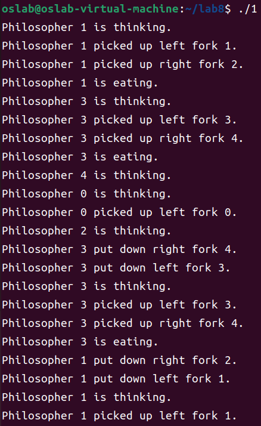
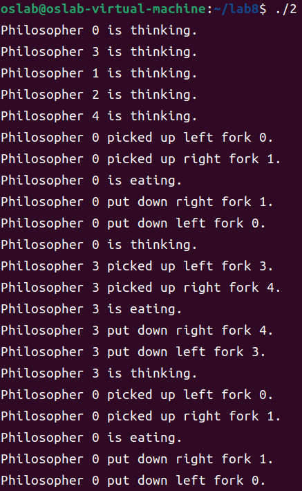
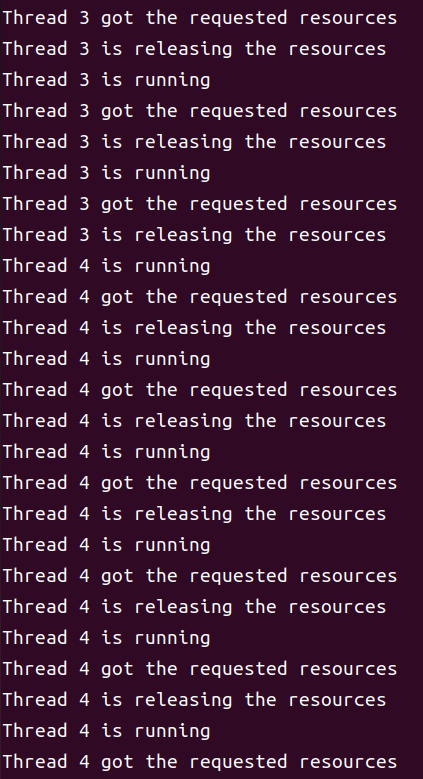

# lab8

## 编程题

在Linux环境中，基于pthread线程，有一系列的系统调用实现对应用程序的线程间同步互斥的支持。

信号量是一种特殊的变量，可用于线程同步。它只取自然数值，并且只支持两种操作：P(SV): 如果信号量SV大于0，将它减一；如果SV值为0，则挂起该线程。V(SV)： 如果有其他进程因为等待SV而挂起，则唤醒，然后将SV+1；否则直接将SV+1。其系统调用为：

- sem_wait(sem_t *sem)：以原子操作的方式将信号量减1，如果信号量值为0，则sem_wait将被阻塞，直到这个信号量具有非0值。
- sem_post(sem_t *sem)：以原子操作将信号量值+1。当信号量大于0时，其他正在调用sem_wait等待信号量的线程将被唤醒。

互斥量：互斥量又称互斥锁，主要用于线程互斥，不能保证按序访问，可以和条件锁一起实现同步。当进入临界区 时，需要获得互斥锁并且加锁；当离开临界区时，需要对互斥锁解锁，以唤醒其他等待该互斥锁的线程。其主要的系统调用如下：

- pthread_mutex_init: 初始化互斥锁
- pthread_mutex_destroy： 销毁互斥锁
- pthread_mutex_lock： 以原子操作的方式给一个互斥锁加锁，如果目标互斥锁已经被上锁，pthread_mutex_lock调用将阻塞，直到该互斥锁的占有者将其解锁。
- pthread_mutex_unlock: 以一个原子操作的方式给一个互斥锁解锁。

条件变量:条件变量，又称条件锁，用于在线程之间同步共享数据的值。条件变量提供一种线程间通信机制：当某个共享数据达到某个值时，唤醒等待这个共享数据的一个/多个线程。即，当某个共享变量等于某个值时，调用 signal/broadcast。此时操作共享变量时需要加锁。其主要的系统调用如下：

- pthread_cond_init: 初始化条件变量
- pthread_cond_destroy： 销毁条件变量
- pthread_cond_signal： 唤醒一个等待目标条件变量的线程。哪个线程被唤醒取决于调度策略和优先级。
- pthread_cond_wait： 等待目标条件变量。需要一个加锁的互斥锁确保操作的原子性。该函数中在进入wait状态前首先进行解锁，然后接收到信号后会再加锁，保证该线程对共享资源正确访问。

### 1.在Linux环境下，请用信号量实现哲学家就餐的多线程应用程序。

```C
#include <stdio.h>
#include <stdlib.h>
#include <pthread.h>
#include <semaphore.h>
#include <unistd.h>

#define NUM_PHILOSOPHERS 5

sem_t forks[NUM_PHILOSOPHERS];
sem_t waiter;

void *philosopher(void *arg) {
    int id = *(int *)arg;
    int left_fork = id;
    int right_fork = (id + 1) % NUM_PHILOSOPHERS;

    while (1) {
        // Thinking
        printf("Philosopher %d is thinking.\n", id);

        // Request forks from waiter
        sem_wait(&waiter);

        // Acquire left fork
        sem_wait(&forks[left_fork]);
        printf("Philosopher %d picked up left fork %d.\n", id, left_fork);

        // Acquire right fork
        sem_wait(&forks[right_fork]);
        printf("Philosopher %d picked up right fork %d.\n", id, right_fork);

        // Eating
        printf("Philosopher %d is eating.\n", id);
        sleep(1);

        // Release right fork
        sem_post(&forks[right_fork]);
        printf("Philosopher %d put down right fork %d.\n", id, right_fork);

        // Release left fork
        sem_post(&forks[left_fork]);
        printf("Philosopher %d put down left fork %d.\n", id, left_fork);

        // Release forks to waiter
        sem_post(&waiter);
    }
}

int main() {
    pthread_t philosophers[NUM_PHILOSOPHERS];
    int philosopher_ids[NUM_PHILOSOPHERS];

    // Initialize semaphores
    sem_init(&waiter, 0, NUM_PHILOSOPHERS - 1);
    for (int i = 0; i < NUM_PHILOSOPHERS; i++) {
        sem_init(&forks[i], 0, 1);
    }

    // Create philosopher threads
    for (int i = 0; i < NUM_PHILOSOPHERS; i++) {
        philosopher_ids[i] = i;
        pthread_create(&philosophers[i], NULL, philosopher, &philosopher_ids[i]);
    }

    // Wait for philosopher threads to finish
    for (int i = 0; i < NUM_PHILOSOPHERS; i++) {
        pthread_join(philosophers[i], NULL);
    }

    // Destroy semaphores
    sem_destroy(&waiter);
    for (int i = 0; i < NUM_PHILOSOPHERS; i++) {
        sem_destroy(&forks[i]);
    }

    return 0;
}
```

这个程序创建了5个哲学家线程，每个哲学家有一个唯一的ID。每个哲学家都通过使用`sem_wait`函数来获取左右两边的叉子（信号量），并使用`sem_post`函数释放叉子。程序中还使用了一个信号量`waiter`来限制同时拿叉子的哲学家数量，以避免死锁。每个哲学家的线程函数不断进行思考、请求叉子、就餐和放下叉子的过程，循环往复。

该程序部分输出如下



### 2.在Linux环境下，请用互斥锁和条件变量实现哲学家就餐的多线程应用程序。

```C
#include <stdio.h>
#include <stdlib.h>
#include <pthread.h>
#include <unistd.h>

#define NUM_PHILOSOPHERS 5

pthread_mutex_t forks[NUM_PHILOSOPHERS];
pthread_mutex_t waiter;
pthread_cond_t forks_available[NUM_PHILOSOPHERS];

void *philosopher(void *arg) {
    int id = *(int *)arg;
    int left_fork = id;
    int right_fork = (id + 1) % NUM_PHILOSOPHERS;

    while (1) {
        // Thinking
        printf("Philosopher %d is thinking.\n", id);
        sleep(1);

        // Request forks from waiter
        pthread_mutex_lock(&waiter);

        // Acquire left fork
        pthread_mutex_lock(&forks[left_fork]);
        printf("Philosopher %d picked up left fork %d.\n", id, left_fork);

        // Acquire right fork
        pthread_mutex_lock(&forks[right_fork]);
        printf("Philosopher %d picked up right fork %d.\n", id, right_fork);

        // Eating
        printf("Philosopher %d is eating.\n", id);
        sleep(1);

        // Release right fork
        pthread_mutex_unlock(&forks[right_fork]);
        printf("Philosopher %d put down right fork %d.\n", id, right_fork);

        // Release left fork
        pthread_mutex_unlock(&forks[left_fork]);
        printf("Philosopher %d put down left fork %d.\n", id, left_fork);

        // Release forks to waiter
        pthread_mutex_unlock(&waiter);

        // Signal that forks are available
        pthread_cond_broadcast(&forks_available[left_fork]);
        pthread_cond_broadcast(&forks_available[right_fork]);
    }
}

int main() {
    pthread_t philosophers[NUM_PHILOSOPHERS];
    int philosopher_ids[NUM_PHILOSOPHERS];

    // Initialize mutexes and condition variables
    pthread_mutex_init(&waiter, NULL);
    for (int i = 0; i < NUM_PHILOSOPHERS; i++) {
        pthread_mutex_init(&forks[i], NULL);
        pthread_cond_init(&forks_available[i], NULL);
    }

    // Create philosopher threads
    for (int i = 0; i < NUM_PHILOSOPHERS; i++) {
        philosopher_ids[i] = i;
        pthread_create(&philosophers[i], NULL, philosopher, &philosopher_ids[i]);
    }

    // Wait for philosopher threads to finish
    for (int i = 0; i < NUM_PHILOSOPHERS; i++) {
        pthread_join(philosophers[i], NULL);
    }

    // Destroy mutexes and condition variables
    pthread_mutex_destroy(&waiter);
    for (int i = 0; i < NUM_PHILOSOPHERS; i++) {
        pthread_mutex_destroy(&forks[i]);
        pthread_cond_destroy(&forks_available[i]);
    }

    return 0;
}
```

在这个程序中，每个哲学家都通过互斥锁来获取和释放左右两边的叉子，并使用条件变量来等待叉子的可用性。程序中还使用了一个互斥锁`waiter`来限制同时拿叉子的哲学家数量，并通过条件变量`forks_available`来通知其他哲学家叉子的可用性。每个哲学家的线程函数循环进行思考、请求叉子、就餐和放下叉子的过程，并在放下叉子后发出信号。

该程序部分输出如下



### 3.在Linux环境下，请建立一个多线程的模拟资源分配管理库，可通过银行家算法来避免死锁。

```C
#include <stdio.h>
#include <pthread.h>

#define NUMBER_OF_THREADS 5
#define NUMBER_OF_RESOURCES 3

int available[NUMBER_OF_RESOURCES];
int maximum[NUMBER_OF_THREADS][NUMBER_OF_RESOURCES];
int allocation[NUMBER_OF_THREADS][NUMBER_OF_RESOURCES];
int need[NUMBER_OF_THREADS][NUMBER_OF_RESOURCES];

pthread_mutex_t mutex;
pthread_cond_t condition;

void request_resources(int thread_num, int request[]);
void release_resources(int thread_num, int release[]);
int safety_algorithm();

void *thread_function(void *arg) {
    int thread_num = *(int *)arg;
    int request[NUMBER_OF_RESOURCES];

    while (1) {
        pthread_mutex_lock(&mutex);

        printf("Thread %d is running\n", thread_num);

        // Generate a random resource request
        for (int i = 0; i < NUMBER_OF_RESOURCES; i++) {
            request[i] = rand() % (maximum[thread_num][i] + 1);
        }

        request_resources(thread_num, request);

        // Check if the system is in a safe state
        if (safety_algorithm()) {
            printf("Thread %d got the requested resources\n", thread_num);
            printf("Thread %d is releasing the resources\n", thread_num);

            // Generate a random resource release
            int release[NUMBER_OF_RESOURCES];
            for (int i = 0; i < NUMBER_OF_RESOURCES; i++) {
                release[i] = rand() % (allocation[thread_num][i] + 1);
            }

            release_resources(thread_num, release);
        } else {
            printf("Thread %d is waiting\n", thread_num);
            pthread_cond_wait(&condition, &mutex);
        }

        pthread_mutex_unlock(&mutex);
    }
}

void request_resources(int thread_num, int request[]) {
    for (int i = 0; i < NUMBER_OF_RESOURCES; i++) {
        if (request[i] > need[thread_num][i] || request[i] > available[i]) {
            printf("Thread %d: Request exceeds maximum or available resources\n", thread_num);
            return;
        }
    }

    for (int i = 0; i < NUMBER_OF_RESOURCES; i++) {
        available[i] -= request[i];
        allocation[thread_num][i] += request[i];
        need[thread_num][i] -= request[i];
    }
}

void release_resources(int thread_num, int release[]) {
    for (int i = 0; i < NUMBER_OF_RESOURCES; i++) {
        available[i] += release[i];
        allocation[thread_num][i] -= release[i];
        need[thread_num][i] += release[i];
    }

    pthread_cond_broadcast(&condition);
}

int safety_algorithm() {
    int work[NUMBER_OF_RESOURCES];
    int finish[NUMBER_OF_THREADS];

    for (int i = 0; i < NUMBER_OF_RESOURCES; i++) {
        work[i] = available[i];
    }

    for (int i = 0; i < NUMBER_OF_THREADS; i++) {
        finish[i] = 0;
    }

    int count = 0;
    while (count < NUMBER_OF_THREADS) {
        int found = 0;

        for (int i = 0; i < NUMBER_OF_THREADS; i++) {
            if (!finish[i]) {
                int j;
                for (j = 0; j < NUMBER_OF_RESOURCES; j++) {
                    if (need[i][j] > work[j]) {
                        break;
                    }
                }

                if (j == NUMBER_OF_RESOURCES) {
                    for (int k = 0; k < NUMBER_OF_RESOURCES; k++) {
                        work[k] += allocation[i][k];
                    }

                    finish[i] = 1;
                    found = 1;
                    count++;
                }
            }
        }

        if (!found) {
            return 0; // Deadlock detected
        }
    }

    return 1; // System is in a safe state
}

int main() {
    pthread_t threads[NUMBER_OF_THREADS];
    int thread_ids[NUMBER_OF_THREADS];

    pthread_mutex_init(&mutex, NULL);
    pthread_cond_init(&condition, NULL);

    // Initialize available, maximum, allocation, and need arrays

    // Create threads
    for (int i = 0; i < NUMBER_OF_THREADS; i++) {
        thread_ids[i] = i;
        pthread_create(&threads[i], NULL, thread_function, (void *)&thread_ids[i]);
    }

    // Join threads
    for (int i = 0; i < NUMBER_OF_THREADS; i++) {
        pthread_join(threads[i], NULL);
    }

    pthread_mutex_destroy(&mutex);
    pthread_cond_destroy(&condition);

    return 0;
}
```

这段代码使用了`pthread`库来创建和管理多线程。其中，`request_resources`函数用于请求资源，`release_resources`函数用于释放资源，`safety_algorithm`函数用于检查系统是否处于安全状态。主函数中创建了多个线程，并在每个线程中循环运行资源请求、资源释放的过程。

该程序部分输出如下



## 问答题

### 1.什么是并行？什么是并发？

- “并行” 指的是同时进行多个任务。在多 CPU 环境中，计算机具有多个独立的 CPU，可以同时执行多个任务。例如，如果你有两个 CPU，那么它们可以同时运行两个不同的程序，这样它们就是并行的。
- “并发” 指的是多个任务的同时发生，但它们不一定是同时执行的。在单 CPU 环境中，并发和并行是通过 CPU 快速地在多个任务之间切换来模拟同时发生的效果。例如，如果你在同时运行多个程序，那么 CPU 可以快速地在这些程序之间切换，从而模拟它们同时发生的效果。这种情况下，这些程序是并发的，但不是并行的。

### 2.为了创造临界区，单核处理器上可以【关中断】，多核处理器上需要使用【自旋锁】。请回答下列问题：

- 多核上可不可以只用【关中断】？

  在多核处理器上仅使用关中断（disable interrupt）来实现临界区是不可行的，因为关中断只能保证当前核上的代码不会被中断，但不能保证其他核上的代码不会进入临界区，对共享数据进行修改。

- 单核上可不可以只用【自旋锁】？

  单核处理器上可以使用自旋锁来实现临界区，但是并不是必须使用自旋锁，如上述的关中断。

- 多核上的【自旋锁】是否需要同时【关中断】？

  对于多核处理器上的自旋锁，通常不需要关中断来创建临界区。相反，自旋锁的实现会使用处理器提供的硬件特性来确保原子性，例如原子操作、内存屏障等。这种方式能够避免全局中断，从而提高系统的性能。

- [进阶] 假如某个锁不会在中断处理函数中被访问，是否还需要【关中断】？

  在单核处理器上，如果所有的代码都是在同一个上下文中运行，也就是没有中断或者线程切换的情况下，如果在代码中使用锁来保护共享资源，那么可以使用简单的互斥锁来实现临界区的保护，而不需要关中断。在多核处理器上，不同的核心可以独立运行不同的线程，彼此之间不会互相干扰。在这种情况下，可以使用自旋锁等更高效的同步机制来实现临界区的保护。如果代码中使用的锁需要在中断处理函数中被访问，那么在多核处理器上需要关中断来保护临界区。在中断处理函数中，由于上下文的切换，可能会发生竞争条件，因此需要通过关中断的方式来避免这种竞争。这样可以保证在中断处理函数执行期间，不会有其他线程在访问共享资源，从而保证临界区的安全性。

### 3.Linux的多线程应用程序使用的锁（例如 pthread_mutex_t）不是自旋锁，当上锁失败时会切换到其它进程执行。分析它和自旋锁的优劣，并说明为什么它不用自旋锁？

- 互斥锁和自旋锁的优劣：互斥锁和自旋锁的本质区别在于加锁失败时，是否会释放CPU。互斥锁在加锁失败时，会释放CPU，因此与自旋锁相比它的主要优势在于可以提高处理器的资源利用率，避免CPU空转的现象，但与之带来的是互斥锁的开销更大。这些开销主要包括两次线程上下文切换的成本：

  当线程加锁失败时，内核会把线程的状态从「运行」状态设置为「睡眠」状态，然后把 CPU 切换给其他线程运行；接着，当锁被释放时，之前「睡眠」状态的线程会变为「就绪」状态，然后内核会在合适的时间，把 CPU 切换给该线程运行。

- 不使用自旋锁的原因是：

  可移植性：pthread_mutex_t是POSIX标准中定义的一种互斥锁，不仅可以在Linux系统上使用，还可以在其他的POSIX兼容系统上使用，提高了应用程序的可移植性。性能：自旋锁在多核处理器上可以提高并发性能，但是在单核处理器上可能会降低性能，因为自旋锁需要不断地检查锁的状态，如果锁一直处于被占用的状态，就会一直占用处理器时间。而pthread_mutex_t是一种阻塞锁，在锁被占用时，会将线程挂起，让出处理器时间，从而避免了空转浪费处理器资源的情况。死锁：使用自旋锁需要非常小心，否则容易出现死锁的情况。例如，当一个线程持有一个自旋锁并等待另一个自旋锁时，如果另一个线程持有了这个自旋锁并等待第一个自旋锁，就会出现死锁。而pthread_mutex_t是一种阻塞锁，在锁的等待队列中维护了线程的等待关系，可以避免死锁的情况。

### 4.程序在运行时具有两种性质：safety: something bad will never happen；liveness: something good will eventually occur. 分析并证明 Peterson 算法的 safety 和 liveness 性质。

下面是这两个性质的证明：

- Safety性质：

  假设同时有两个线程$P_0$和$P_1$，它们都试图进入其临界区，即执行关键代码段。如果两个线程同时进入关键代码段，就会发生竞态条件，可能导致不正确的结果。因此，我们希望确保只有一个线程能够进入其临界区。Peterson算法确保了只有一个线程可以进入其临界区。这是因为，在进入临界区之前，线程必须首先尝试获取锁。如果另一个线程已经获得了锁，则当前线程将被阻塞，直到另一个线程释放锁。因此，只有一个线程可以进入其临界区，这证明了Peterson算法的safety性质。

- Liveness性质：

  我们需要证明，如果一个线程尝试进入其临界区，则它最终将能够进入。假设线程$P_0$和$P_1$都试图进入其临界区。如果线程$P_0$先尝试进入其临界区，则线程$P_1$会被阻塞，直到线程$P_0$退出其临界区并释放锁。反之亦然。假设线程$P_0$试图进入其临界区，但是线程$P_1$已经占用了锁并且正在执行其临界区。线程$P_0$将被阻塞，并等待线程$P_1$释放锁。线程$P_1$将在其临界区内执行，并最终退出其临界区并释放锁。此时，线程$P_0$将获得锁，并能够进入其临界区。同样，如果线程$P_1$试图进入其临界区，那么也将发生类似的过程。

因此，Peterson算法保证了线程能够最终进入其临界区，这证明了Peterson算法的liveness性质。

### 5.信号量结构中的整数分别为+n、0、-n 的时候，各自代表什么状态或含义？

- +n：还有 n 个可用资源
- 0：所有可用资源恰好耗尽
- -n：有n个进程申请了资源但无资源可用，被阻塞。

### 6.考虑如下信号量实现代码：

```cpp
class Semaphore {
  int sem;
  WaitQueue q;
}
Semaphore::P() {
  sem --;
  if(sem < 0) {
    Add this thread to q.
    block.
  }
}
Semaphore::V() {
  sem ++;
  if(sem <= 0) {
    t = Remove a thread from q;
    wakeup(t);
  }
}
```

假如 P操作或V操作不是原子操作，会出现什么问题？举一个例子说明。上述代码能否运行在用户态？上面代码的原子性是如何保证的？

> 如果P操作或V操作不是原子操作，将无法实现资源的互斥访问。P操作和V操作都是通过关中断来实现的（可以再确认一下这点）。上述代码不能运行在用户态，因为这将带给用户态程序使能/屏蔽中断这种特权，相当于相信应用并放权给它。这会面临和我们引入抢占式调度之前一样的问题：线程可以选择恶意永久关闭中断而独占所有 CPU 资源，这将会影响到整个系统的正常运行。因此，事实上至少在 RISC-V 这样含多个特权级的架构中，这甚至是完全做不到的。

### 7.条件变量的 Wait 操作为什么必须关联一个锁？

当调用条件变量的 wait 操作阻塞当前线程的时候，该操作是在管程过程中，因此此时当前线程持有锁。在持有锁的情况下不能陷入阻塞 ，因此在陷入阻塞状态之前当前线程必须先释放锁；当被阻塞的线程被其他线程使用 signal 操作唤醒之后，需要重新获取到锁才能继续执行，不然的话就无法保证管程过程的互斥访问。

因此，站在线程的视角，必须持有锁才能调用条件变量的 wait 操作阻塞自身。

### 8.下面是条件变量的wait操作实现伪代码：

```cpp
Condvar::wait(lock) {
  Add this thread to q.
  lock.unlock();
  schedule();
  lock.lock();
}
```

如果改成下面这样：

```cpp
Condvar::wait() {
  Add this thread to q.
  schedule();
}
lock.unlock();
condvar.wait();
lock.lock();
```

会出现什么问题？举一个例子说明。

> 这种情况就是第7题提到的条件变量的wait操作没有关联一个锁。会造成被阻塞的线程被其他线程使用 signal 操作唤醒之后，无法获取锁，从而无法保证管程过程的互斥访问，导致管程失效。

### 9.死锁的必要条件是什么？

死锁的四个必要条件：

- 互斥条件：一个资源每次只能被一个进程使用。
- 请求与保持条件：一个进程因请求资源而阻塞时，对已获得的资源保持不放。
- 不剥夺条件:进程已获得的资源，在末使用完之前，不能被其他进程强行剥夺。
- 循环等待条件:若干进程之间形成一种头尾相接的循环等待资源关系。

这四个条件是死锁的必要条件，只要系统发生死锁，这些条件必然成立，而只要上述条件之一不满足，就不会发生死锁。

### 10.什么是死锁预防，举例并分析。

预防死锁只需要破坏死锁的四个必要条件之一即可，例如：

- 破坏互斥条件
- 破坏不可剥夺条件： 当进程的新资源不可取得时，释放自己已有的资源，待以后需要时重新申请。
- 破坏请求并保持条件：进程在运行前一次申请完它所需要的全部资源，在它的资源为满足前，不把它投入运行。一旦投入运行，这些资源都归它所有，不能被剥夺。
- 破坏循环等待条件：给锁/访问的资源进行排序，要求每个线程都按照排好的顺序依次申请锁和访问资源

### 11.描述银行家算法如何判断安全性。

- 设置两个向量:工作向量Work，表示操作系统可提供给线程继续运行所需的各类资源数目，它含有m个元素，初始时，Work = Available；结束向量Finish，表示系统是否有足够的资源分配给线程，使之运行完成。初始时 Finish[0..n-1] = false，表示所有线程都没结束；当有足够资源分配给线程时，设置Finish[i] = true。
- 从线程集合中找到一个能满足下述条件的线程

```cpp
Finish[i] == false;
Need[i,j] <= Work[j];
```

若找到，执行步骤3，否则，执行步骤4。

- 当线程thr[i]获得资源后，可顺利执行，直至完成，并释放出分配给它的资源，故应执行:

```cpp
Work[j] = Work[j] + Allocation[i,j];
Finish[i] = true;
```

跳转回步骤2

- 如果Finish[0..n-1] 都为true，则表示系统处于安全状态；否则表示系统处于不安全状态。

通过操作系统调度，如银行家算法来避免死锁不是广泛使用的通用方案。因为从线程执行的一般情况上看，银行家算法需要提前获知线程总的资源申请量，以及未来的每一次请求，而这些请求对于一般线程而言在运行前是不可知或随机的。另外，即使在某些特殊情况下，可以提前知道线程的资源申请量等信息，多重循环的银行家算法开销也是很大的，不适合于对性能要求很高的操作系统中。