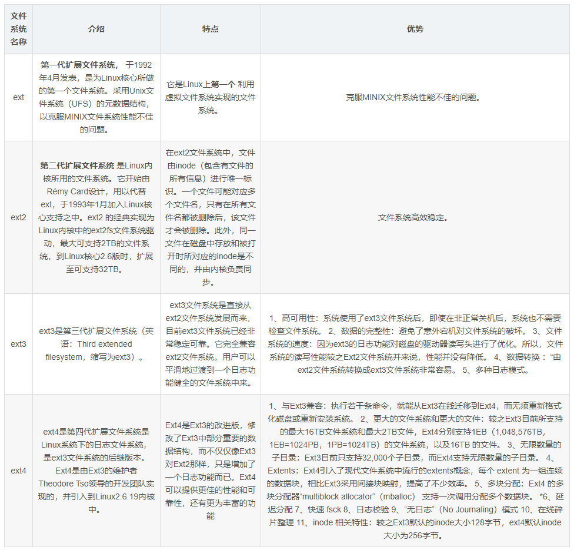
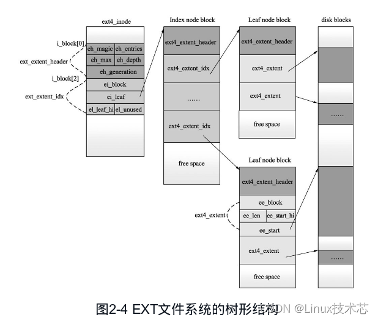
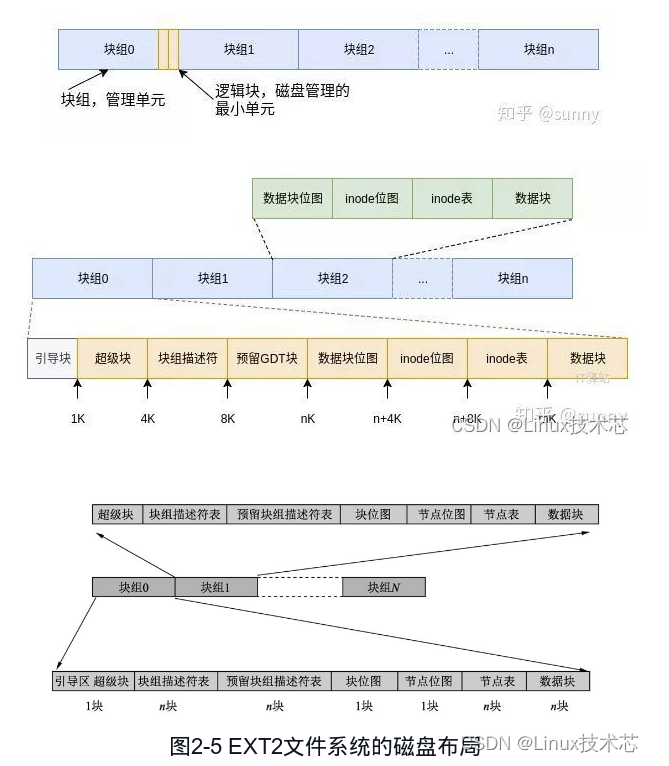
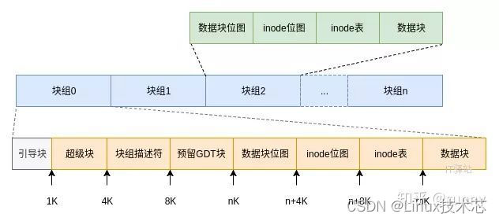

## linux文件系统的调用

虚拟文件系统（VFS）为用户程序提供文件和文件系统操作的统一接口，屏蔽不同文件系统的差异和操作细节。借助 VFS 可以直接使用`open()`、`read()`、`write()`这样的系统调用操作文件，而无须考虑具体的文件系统和实际的存储介质。

### 1.`open()` 系统调用

Linux 使用`open()`系统调用来打开文件，并返回该文件对应的文件描述符。

```c
#include <sys/types.h>
#include <sys/stat.h>
#include <fcntl.h>
//当文件存在时
int open(const char *pathname, int flags);
//当文件不存在时
int open(const char *pathname, int flags, mode_t mode);
```

函数参数的具体说明如下：

- `pathname`：要打开或创建的文件名；
- `flag`：指定文件的打开方式，具体有以下参数，见下表`flag`参数值。
- 返回值
  成功：文件描述符
  失败：-1

当文件不存在时，除了`pathname`和`flags`之外，还需要指定文件权限模式 `mode`。当文件不存在时，函数会创建一个新文件，并设置文件的权限模式。

表`flag`参数值

### 2.`read()` 系统调用

`read()` 系统调用用于从文件中读取若干个字节的数据，保存到数据缓冲区 buf 中，并返回实际读取的字节数

```C
#include <unistd.h>
ssize_t read(int fd, void *buf, size_t count);
```

具体函数参数如下：

- fd：文件对应的文件描述符，可以通过 fopen 函数获得。另外，当一个程序运行时，Linux默认有 0、1、2 这三个已经打开的文件描述符，分别对应了标准输入、标准输出、标准错误输出，即可以直接访问这三种文件描述符；

- buf：指向数据缓冲区的指针；

- count：读取多少个字节的数据。

- 返回值
  失败：-1，读取错误

  成功：

  count：成功读取全部字节

  0~count:

  - 剩余文件长度小于count
  - 读取期间被异步信号打断

### 3.`write()` 系统调用

`write()` 系统调用用于往文件写入内容，并返回实际写入的字节长度

```C
#include <unistd.h>
ssize_t write(int fd, const void *buf, size_t count)
```

具体函数参数如下：

- fd：文件对应的文件描述符，可以通过 fopen 函数获得。

- buf：指向数据缓冲区的指针；

- count：往文件中写入多少个字节。

- 返回值
  失败：-1，读取错误

  成功：

  - count：成功读取全部字节
  - 0~count：读取期间被异步信号打断

# EXT2文件系统

EXT2 是 Linux 上标准的文件系统，EXT3 是在 EXT2 基础上增加日志形成的，其思想可以追溯到早期UNIX家族发展的基于超级块和 inode 的经典概念，EXT4 是 EXT3 的进一步升级，它提供了更高的性能和更好的可靠性。因此，本次主要讲述 EXT2 文件系统。

## ext、ext2、ext3、ext4 文件系统对比



## 1.树形目录结构

EXT文件系统采用一个独立的顶级树形目录架构（即所有一切都从 root 根目录开始，延伸到子目录）来组织和管理全部文件。目录文件记录了本目录下所有文件和子目录的信息（文件名和索引节点号 inode ），并依次存放在数据块中，采用把文件名（放在目录文件中）与文件的其他所有属性（放在索引节点 inode 表中）分开存储的管理方法来大大提高文件检索的速度。

```c
/*
 * 磁盘上inode的结构
 */
struct ext2_inode {
   __le16    i_mode;        /* 文件类型和访问权限 */
   __le16    i_uid;        /* 文件所有者的低 16 位 UID */
   __le32    i_size;        /* 文件大小，以字节为单位 */
   __le32    i_atime;    /* 上次访问时间 */
   __le32    i_ctime;    /* 文件创建时间 */
   __le32    i_mtime;    /* 上次修改时间 */
   __le32    i_dtime;    /* 文件删除时间 */
   __le16    i_gid;        /* 文件所有者的低 16 位 GID */
   __le16    i_links_count;    /* 文件的硬链接数量 */
   __le32    i_blocks;    /* 文件占用的块数 */
   __le32    i_flags;    /* 文件标志 */

.......
    __le32    i_block[EXT2_N_BLOCKS];/* 指向块的指针 */
.......
};
```



## 2.磁盘布局

图为EXT2文件系统的磁盘布局。



在EXT文件系统中，存储的最小单位是块（block），一个块究竟多大是在格式化时确定的，如可以设定块大小为1024、2048或4096字节，一旦文件系统创建好以后，块的大小就不能改变了。

这些块被聚在一起分成几个大的块组（block group）。每个块组中有多少个块是固定的（最后一个块组除外，其所管理的块可能会少一些）。而启动块（boot block）的大小是确定的，即1KB，启动块由PC标准规定，用来存储磁盘分区信息和启动信息，任何文件系统都不能使用启动块。

启动块之后才是EXT文件系统的开始，EXT文件系统将整个分区划成若干个同样大小的块组，每个块组都由以下部分组成：超级块（superblock）、块组描述符表（GDT）、预留块组描述符表（reserved GDT）、块位图（block bitmap）、节点位图（inode bitmap）、节点表（inode table）和数据块（datablock）。

可以通过`dumpe2fs`工具显示 ext2/ext3/ext4 文件系统的详细信息

1. 在Linux系统上安装`e2fsprogs`软件包。`e2fsprogs`是一个用于管理ext2/ext3/ext4文件系统的软件包，其中包含了`dumpe2fs`命令。
2. 创建一个 ext2 文件系统镜像文件。可以使用 dd 命令从一个空白文件中创建一个 ext2 文件系统，例如：

```shell
dd if=/dev/zero of=ext2.bin bs=1M count=100
mkfs.ext2 ext2.bin
```

以上命令将在当前目录下创建一个大小为 100MB 的 ext2 文件系统镜像文件`ext2.bin`，并格式化为 ext2 文件系统。

3. 使用`dumpe2fs`命令查看文件系统的详细信息。例如：

```bash
dumpe2fs ext2.bin
```

以上命令将显示`ext2.bin`文件系统的超级块信息、块组信息、 inode 信息和统计信息等。

### 超级块

**superblock**：记录文件系统的整体信息，包含 inode/block 的大小、总量、使用量、剩余量，以及文件系统的格式，文件系统挂载时间，最近一次数据写入时间，最近一次校验磁盘的时间等。

```C
/*
 * 超级块的结构
*/
struct ext2_super_block {
	__le32	s_inodes_count;		/* Inodes count */
	__le32	s_blocks_count;		/* Blocks count */
	__le32	s_r_blocks_count;	/* Reserved blocks count */
	__le32	s_free_blocks_count;	/* Free blocks count */
	__le32	s_free_inodes_count;	/* Free inodes count */
	__le32	s_first_data_block;	/* First Data Block */
	__le32	s_log_block_size;	/* Block size */
	__le32	s_log_frag_size;	/* Fragment size */
	__le32	s_blocks_per_group;	/* # Blocks per group */
	__le32	s_frags_per_group;	/* # Fragments per group */
	__le32	s_inodes_per_group;	/* # Inodes per group */
	__le32	s_mtime;		/* Mount time */
	__le32	s_wtime;		/* Write time */
	__le16	s_mnt_count;		/* Mount count */
	__le16	s_max_mnt_count;	/* Maximal mount count */
	__le16	s_magic;		/* Magic signature */
	__le16	s_state;		/* File system state */
	__le16	s_errors;		/* Behaviour when detecting errors */
	__le16	s_minor_rev_level; 	/* minor revision level */
	__le32	s_lastcheck;		/* time of last check */
	__le32	s_checkinterval;	/* max. time between checks */
	__le32	s_creator_os;		/* OS */
	__le32	s_rev_level;		/* Revision level */
	__le16	s_def_resuid;		/* Default uid for reserved blocks */
	__le16	s_def_resgid;		/* Default gid for reserved blocks */
	/*
	 * These fields are for EXT2_DYNAMIC_REV superblocks only.
	 *
	 * Note: the difference between the compatible feature set and
	 * the incompatible feature set is that if there is a bit set
	 * in the incompatible feature set that the kernel doesn't
	 * know about, it should refuse to mount the filesystem.
	 * 
	 * e2fsck's requirements are more strict; if it doesn't know
	 * about a feature in either the compatible or incompatible
	 * feature set, it must abort and not try to meddle with
	 * things it doesn't understand...
	 */
	__le32	s_first_ino; 		/* First non-reserved inode */
	__le16   s_inode_size; 		/* size of inode structure */
	__le16	s_block_group_nr; 	/* block group # of this superblock */
	__le32	s_feature_compat; 	/* compatible feature set */
	__le32	s_feature_incompat; 	/* incompatible feature set */
	__le32	s_feature_ro_compat; 	/* readonly-compatible feature set */
	__u8	s_uuid[16];		/* 128-bit uuid for volume */
	char	s_volume_name[16]; 	/* volume name */
	char	s_last_mounted[64]; 	/* directory where last mounted */
	__le32	s_algorithm_usage_bitmap; /* For compression */
	/*
	 * Performance hints.  Directory preallocation should only
	 * happen if the EXT2_COMPAT_PREALLOC flag is on.
	 */
	__u8	s_prealloc_blocks;	/* Nr of blocks to try to preallocate*/
	__u8	s_prealloc_dir_blocks;	/* Nr to preallocate for dirs */
	__u16	s_padding1;
	/*
	 * Journaling support valid if EXT3_FEATURE_COMPAT_HAS_JOURNAL set.
	 */
	__u8	s_journal_uuid[16];	/* uuid of journal superblock */
	__u32	s_journal_inum;		/* inode number of journal file */
	__u32	s_journal_dev;		/* device number of journal file */
	__u32	s_last_orphan;		/* start of list of inodes to delete */
	__u32	s_hash_seed[4];		/* HTREE hash seed */
	__u8	s_def_hash_version;	/* Default hash version to use */
	__u8	s_reserved_char_pad;
	__u16	s_reserved_word_pad;
	__le32	s_default_mount_opts;
 	__le32	s_first_meta_bg; 	/* First metablock block group */
	__u32	s_reserved[190];	/* Padding to the end of the block */
};
```

在超级块中，魔数是一个很重要的字段，在 EXT2/EXT3/EXT4 中，这个字段的值为`0xef53`，否则这个分区就不是一个正常的 EXT2/EXT3/EXT4 文件系统。 

```txt
szh@ubuntu:~$ hexdump  -n 1024 -s 1024 ext2.bin
0000400 6400 0000 6400 0000 0500 0000 60d0 0000
0000410 63f5 0000 0000 0000 0002 0000 0002 0000
0000420 8000 0000 8000 0000 6400 0000 0000 0000
0000430 1012 645d 0000 ffff ef53 0001 0001 0000　//ef53
0000440 1012 645d 0000 0000 0000 0000 0001 0000
0000450 0000 0000 000b 0000 0080 0000 0038 0000
0000460 0002 0000 0003 0000 879a eba8 8827 904d
0000470 dab4 b49d 6dd8 00a2 0000 0000 0000 0000
0000480 0000 0000 0000 0000 0000 0000 0000 0000
*
00004c0 0000 0000 0000 0000 0000 0000 0000 0006
00004d0 0000 0000 0000 0000 0000 0000 0000 0000
00004e0 0000 0000 0000 0000 0000 0000 eb21 2c9b
00004f0 d538 b64e 3799 7e05 c061 1e49 0001 0000
0000500 000c 0000 0000 0000 1012 645d 0000 0000
0000510 0000 0000 0000 0000 0000 0000 0000 0000
*
0000560 0001 0000 0000 0000 0000 0000 0000 0000
0000570 0000 0000 0000 0000 0000 0000 0000 0000
*
0000800
```

以上命令输出了`ext2.bin`文件的16进制编码，并从偏移量 1024 处开始显示 1024 个字节的数据。在输出结果中，可以看到文件系统的魔数为`0xef53`。

### 块组描述符表

块组描述符表（GDT, Group Descriptor Table）由很多块组描述符组成，整个分区分成多少个块组就对应有多少个块组描述符。每个块组描述符存储一个块组的描述信息，如在这个块组中从哪里开始是 inode 表、从哪里开始是数据块、空闲的 inode 和数据块还有多少个等。与超级块类似，块组描述符表在每个块组的开头也都有一份拷贝，这些信息是非常重要的，一旦超级块意外损坏就会丢失整个分区的数据。通常内核只用到第0个块组中的拷贝，当执行`e2fsck`检查文件系统一致性时，第 0 个块组中的超级块和块组描述符表就会拷贝到其他块组，这样当第 0 个块组的开头意外损坏时就可以用其他拷贝来恢复，从而减少损失。



### 块位图

数据块存储所有文件的数据，比如某个分区的块大小是1024字节，某个文件是 2049 字节，那么就需要三个数据块来存储，即使第三个块只存储一字节也需要占用一个整块；超级块、块组描述符表、块位图、 inode 位图、 inode 表这几部分存储该块组的描述信息。那么如何知道哪些块已经用来存储文件数据或其他描述信息，哪些块仍然空闲可用呢？块位图就是用来描述整个块组中哪些块已用、哪些块空闲的，它本身占一个块，其中的每位代表本块组中的一个块，该位为 1 表示该块已用，为 0 表示该块空闲可用。

### 节点位图

与块位图类似，本身占一个块，其中每位表示一个 inode 是否空闲可用。

### 节点表

我们知道，一个文件除了数据需要存储之外，一些描述信息也需要存储，如文件类型（常规、目录、符号链接等）、权限、文件大小、创建/修改/访问时间等，这些信息存在 inode 中而不是数据块中。每个文件都有一个 inode ，一个块组中的所有 inode 组成了 inode 表（节点表）。

inode 表占多少个块在格式化时就要决定并写入块组描述符中，`mke2fs`格式化工具的默认策略是一个块组有多少个 8KB 就分配多少个 inode 。由于数据块占了整个块组的绝大部分，也可以近似认为数据块有多少个 8KB 就分配多少个 inode ，换句话说，如果平均每个文件的大小是 8KB ，当分区存满的时候 inode 表会得到比较充分的利用，数据块也不浪费；如果这个分区存的都是很大的文件（比如电影），则数据块用完的时候 inode 会有一些浪费；如果这个分区存的都是很小的文件（比如源代码），则有可能数据块还没用完 inode 就已经用完了，数据块可能有很大的浪费。如果用户在格式化时能够对这个分区以后要存储的文件大小进行预测，也可以用`mke2fs`的`-i`参数手动指定每多少字节分配一个 inode 。

**inode**：记录文件的属性，一个文件占用一个 inode ，inode 大小( ext2 中)大约为 128B ，并记录文件数据所在的 block 号码，具体来说包含的信息如下：

- 文件的字节数

- 文件拥有者的User ID

- 文件的Group ID

- 文件的读、写、执行权限

- 文件的时间戳，共有三个：`ctime`表示 inode 上一次变动的时间，`mtime`表示文件内容上一次变动的时间，`atime`表示文件上一次打开的时间

- 链接数：指有多少文件名指向这个 inode

- 文件数据的 block 号码
  在文件的 block 数量很大时，通常会采用多级 block 来记录 block 号码，这里采用 **Bitmap** 标记未使用的 inode 号码。

### 数据块

根据不同的文件类型有以下几种情况：

1. 对于常规文件，文件的数据存储在数据块中。

2. 对于目录，该目录下的所有文件名和目录名存储在数据块中，注意文件名保存在它所在目录的数据块中，除文件名之外，`ls -l`命令看到的其他信息都保存在该文件的 inode 中。注意这个概念：目录也是一种文件，是一种特殊类型的文件。

3. 对于符号链接，如果目标路径名较短则直接保存在 inode 中以便更快地查找，如果目标路径名较长则分配一个数据块来保存。

4. 设备文件、FIFO 和 socket 等特殊文件没有数据块，设备文件的主设备号和次设备号保存在 inode 中。

## 3.日志系统

对文件的存储包括对文件数据（data）和文件属性（元数据，metadata）的存储。为了在意外情况（如系统崩溃）下，可以通过恢复程序保证数据的一致性和完整性，EXT3 文件系统引入了日志的概念，EXT4 还能对日志进行校验和，确保有效的数据变更能够在底层文件系统上正确完成。EXT3/4 日志存放在`journal`文件中，并提供了三种日志的记录方式：

1）`data=writeback`方式：在这种方式下，EXT3 文件系统只对元数据写日志。虽然这会让最近修改的文件在出现意外事件时损坏，但可以得到较高的速度。

2）`data=ordered`方式（默认方式）：在这种方式下，EXT3 文件系统也只将元数据写入日志系统，但还把对数据的每一次更新都作为一个事务写入相关文件中，这样有效地解决了第一种方式中文件数据被损坏的问题。但是文件系统的运行速度要稍慢些，且不能解决文件数据被覆盖时系统崩溃而无法恢复的问题。

3）`data=journal`方式：在这种方式下，EXT3 文件系统提供了完整的文件数据和元数据的日志记录，再写入它的最终位置。这样在系统崩溃时，就可以通过日志来完全修复，保证文件数据和元数据的一致性。 